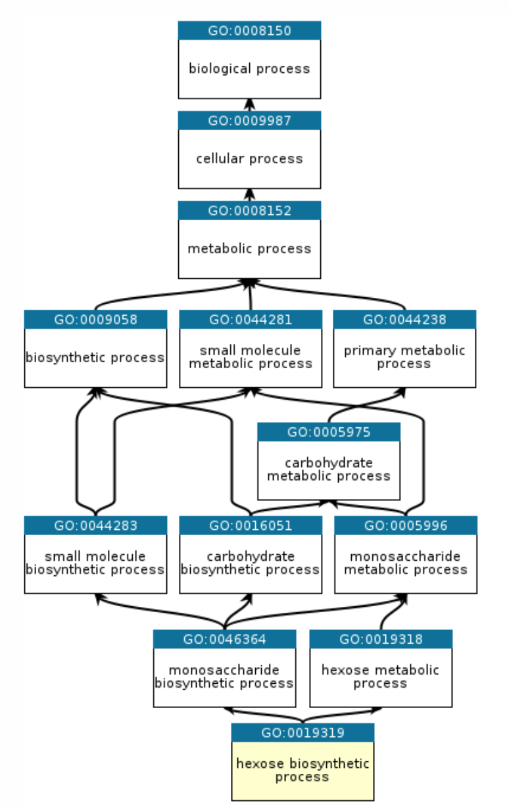

# GOVis

GOVis is a local viewer for Gene Ontology `is_a` graphs. It maps GO terms or genes into an interactive ontology graph, hides obsolete terms by default, and can show organism-specific gene annotations from GAF files.

The interface is based on [AmiGO 2](https://amigo.geneontology.org/amigo) and [QuickGO](https://www.ebi.ac.uk/QuickGO/).



## Features

- GO term and gene input
- `is_a` graph mapping
- readable and compact layouts
- organism-specific gene lookup
- PNG, SVG, and PDF export

## Run locally

```cmd
build.cmd
run
```

Open `http://127.0.0.1:8000/`.
